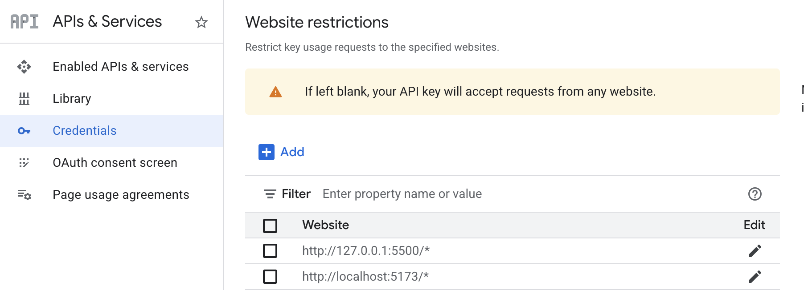
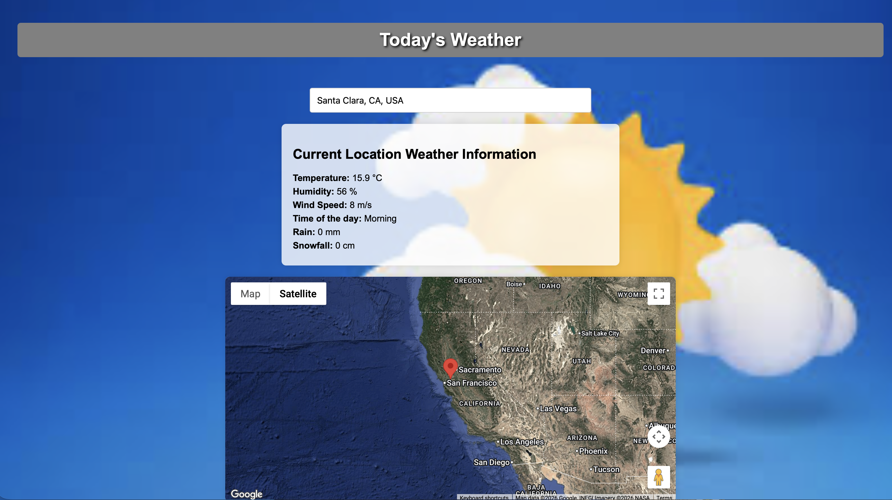

# TodaysWeatherDreamTheCode
This is the Pre Work Project Dream The Code.
A web Application that shows current weather and its location in google map

### Description
This website fetches the latitude and longitude of the user’s current location or a city selected via autocomplete. It displays real-time weather information including temperature, humidity, wind speed, day/night status, rainfall, and snowfall. The exact location is marked on an interactive map, and the background dynamically changes based on the time of day and current weather conditions such as clear skies, rain, or snow.


### Features
1.Autocomplete city search using Google Places API

2.Shows current weather: temperature, humidity, wind speed

3.Dynamic background images based on weather

4.Interactive Google Map with marker at current location


### Installation & Setup

1.  **Clone the repository**
    ```git clone [https://github.com/tryphenaP/TodaysWeatherDreamTheCode](https://github.com/tryphenaP/TodaysWeatherDreamTheCode) && cd TodaysWeatherDreamTheCode```

2.  **Install Dependencies**
    This project uses Vite and other Node packages. You must install them before running.
    ```npm install```

3.  **Configure Environment Variables**
    This project requires a Google Maps API Key to work.
    * Create a file named `.env` in the root folder.
    * Add your Google Maps API key using the exact variable name below:
        ```VITE_API_KEY=your_google_maps_api_key_here```
    Note that you would need to allow which Websites have access to the API Key, you could do this on the Google Cloud Console. In the next step, make sure that you use the correct website name and port address to pin it in Vite

    

4.  **Configure Port Pinning (Optional but Recommended)**
    To ensure the app always runs on port `5173` (which matches the Google Cloud API restrictions), create a file named `vite.config.js` in the root folder with this content:
    ```javascript
    import { defineConfig } from 'vite'

    export default defineConfig({
      server: {
        port: 5173,
        strictPort: true, // Forces the app to crash if port 5173 is busy, rather than switching ports
      }
    })
    ```
5.  **Run the Project**
    Start the local development server:
    ```npm run dev```
    Open your browser and visit: `http://localhost:5173`

    *Note: If you see an error saying "Port 5173 is already in use," you must close the other instance running on that port before starting this one. Use kill -p <PID>*

### Technologies
- HTML, CSS, JavaScript
- Google Maps API
- Open-Meteo API
- VS Code for development

### Screenshots of working model
Day & Clear sky


&nbsp;&nbsp;&nbsp;&nbsp;&nbsp;&nbsp;&nbsp;&nbsp;&nbsp;&nbsp;&nbsp;&nbsp;&nbsp;&nbsp;&nbsp;&nbsp;&nbsp;&nbsp;&nbsp;&nbsp;&nbsp;&nbsp;&nbsp;&nbsp;&nbsp;&nbsp;&nbsp;&nbsp;&nbsp;&nbsp;&nbsp;&nbsp;
Night & Clear sky


&nbsp;&nbsp;&nbsp;&nbsp;&nbsp;&nbsp;&nbsp;&nbsp;&nbsp;&nbsp;&nbsp;&nbsp;&nbsp;&nbsp;&nbsp;&nbsp;&nbsp;&nbsp;&nbsp;&nbsp;&nbsp;&nbsp;&nbsp;&nbsp;&nbsp;&nbsp;&nbsp;&nbsp;&nbsp;&nbsp;&nbsp;&nbsp;

Day & Raining


&nbsp;&nbsp;&nbsp;&nbsp;&nbsp;&nbsp;&nbsp;&nbsp;&nbsp;&nbsp;&nbsp;&nbsp;&nbsp;&nbsp;&nbsp;&nbsp;&nbsp;&nbsp;&nbsp;&nbsp;&nbsp;&nbsp;&nbsp;&nbsp;&nbsp;&nbsp;&nbsp;&nbsp;&nbsp;&nbsp;&nbsp;&nbsp;
Day & Snowy


&nbsp;&nbsp;&nbsp;&nbsp;&nbsp;&nbsp;&nbsp;&nbsp;&nbsp;&nbsp;&nbsp;&nbsp;&nbsp;&nbsp;&nbsp;&nbsp;&nbsp;&nbsp;&nbsp;&nbsp;&nbsp;&nbsp;&nbsp;&nbsp;&nbsp;&nbsp;&nbsp;&nbsp;&nbsp;&nbsp;&nbsp;&nbsp;
Night & Raining


&nbsp;&nbsp;&nbsp;&nbsp;&nbsp;&nbsp;&nbsp;&nbsp;&nbsp;&nbsp;&nbsp;&nbsp;&nbsp;&nbsp;&nbsp;&nbsp;&nbsp;&nbsp;&nbsp;&nbsp;&nbsp;&nbsp;&nbsp;&nbsp;&nbsp;&nbsp;&nbsp;&nbsp;&nbsp;&nbsp;&nbsp;&nbsp;
Night & Snowy


&nbsp;&nbsp;&nbsp;&nbsp;&nbsp;&nbsp;&nbsp;&nbsp;&nbsp;&nbsp;&nbsp;&nbsp;&nbsp;&nbsp;&nbsp;&nbsp;&nbsp;&nbsp;&nbsp;&nbsp;&nbsp;&nbsp;&nbsp;&nbsp;&nbsp;&nbsp;&nbsp;&nbsp;&nbsp;&nbsp;&nbsp;&nbsp;

